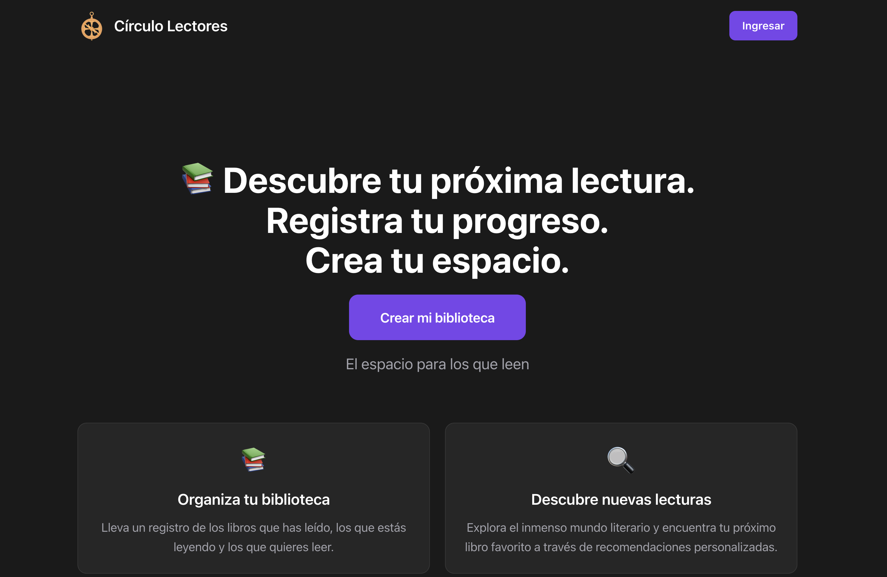

# 📚 Círculo Lectores
**Your online library!**  

Círculo Lectores is a simple and intuitive platform that allows users to track the books they read & want to read as well as add book reviews and quotes from a particular book.

---

## 🌟 Key Features  

1. **Robust Backend**: Powered by Python and Flask, our backend provides a reliable and scalable server to support all operations.  
2. **Responsive Design**: Fully optimized for use on any device—mobile, tablet, or desktop.  
3. **Dynamic User Interface**: Sleek and modern UI for an enhanced user experience.  
4. **Global State Management**: Efficient state handling using Context API.  
5. **Reliable Database**: Built with SQLAlchemy for secure and robust data management.  
6. **Data Integration**: Seamless integration of Open Library.

---

## 🚀 Technologies Used  

### **Frontend**  
- 🏷️ **HTML5**: Semantic content structure.  
- 🎨 **CSS3**: Custom styles for a responsive design.
<i class="glyphicon glyphicon-bold"></i> **Bootstrap**: Quick components and responsive grid systems.  
- 💻 **JavaScript**: Interactivity and client-side logic.  
- ⚛️ **React.js**: Reusable components and state management with Flux.  

### **Backend**  
- 🐍 **Python**: Server-side logic and data handling.  
- 🌐 **Flask**: Framework for routing, authentication, and database connections.  
- ☁️ **APIs**: Integration of external services, such as books' data.  

### **State & Data Management**  
- **Context API**: Global state management.  
- **Custom APIs**: Handling data storage for each user.

---

## 🤝 Collaborators

- [Pedro](https://github.com/celse93)  
- [ECG](https://github.com/dev-ecg)  
- [Melisa](https://github.com/MelisaRM)

---
### [CHECK IT OUT!](https://react-frontend-ijog.onrender.com/login)

---

## 🏠 Root

The root of the project is set up with **automatic pre-commit autolinting** for **JavaScript** and **Python** using **Prettier** 🖋️ and **Ruff** 🐍.  

## 🌐 Web (`/web`)

### ⚛️ React Template

The front-end uses a **React template from Vite**.  
Scaffolding reference: [Vite Docs](https://vite.dev/guide/#scaffolding-your-first-vite-project)  

### 📦 Necessary Packages for FE

#### Utilities

- **lodash**: Functional utilities [GitHub](https://github.com/lodash/lodash?tab=readme-ov-file#installation) 🔧
- **react-router**: Routing library [Docs](https://reactrouter.com/start/library/installation) 🛣️

#### Data Fetching

- **axios**: HTTP client [Docs](https://axios-http.com/docs/intro) ⚡
- **react-query**: Server-state management [Docs](https://tanstack.com/query/latest/docs/framework/react/installation) 📡

#### Styling & Components

- **Material-UI**: Modern UI components [Docs](https://mui.com/material-ui/getting-started/installation) 🎨
- **React Bootstrap**: Bootstrap components [Docs](https://react-bootstrap.netlify.app/docs/getting-started/introduction) 🅱️
- **Reactstrap**: Bootstrap 4 components [Docs](https://reactstrap.github.io/?path=/docs/home-installation--page#getting-started) 🖼️
- **Ant Design**: Enterprise UI [Docs](https://ant.design/docs/react/use-with-vite) 🏢
- **Tailwind CSS**: Utility-first CSS [Docs](https://tailwindcss.com/docs/installation/using-vite) 🌬️

## 🖥️ API (`/api`)

### 🐍 Pipenv

Back-end uses **Pipenv** for dependency management.  
Installation reference: [Pipenv Docs](https://pipenv.pypa.io/en/latest/installation.html#preferred-installation-of-pipenv)  

### 📦 Necessary Packages for BE

- **Flask**: Web framework [Docs](https://flask.palletsprojects.com/en/stable/installation/) 🌐
- **Flask-CORS**: Cross-origin requests [PyPI](https://pypi.org/project/Flask-Cors/) 🌏
- **Flask-Migrate**: DB migrations [Docs](https://flask-migrate.readthedocs.io/en/latest/#installation) 🗄️
- **Flask-SQLAlchemy**: ORM for Flask [Docs](https://flask-sqlalchemy.readthedocs.io/en/stable/quickstart/#installation) 🐘
- **Gunicorn**: WSGI server [Docs](https://gunicorn.org/) 🚀
- **SQLAlchemy**: Database toolkit [Docs](https://docs.sqlalchemy.org/en/20/intro.html#installation) 🛠️

### 🔑 Environment Variables

Make sure your environment variables are correctly set for **development** (Codespaces) and **deployment** (Render).  

- `DATABASE_URL` 🌐 → Your external database URL from the DB in the Render project 
- `JWT_SECRET_KEY` 🔑 → Your generated secret string  

---

💡 **Tip:** Keep this README handy as your **quick-start guide** for both front-end and back-end setup!  
